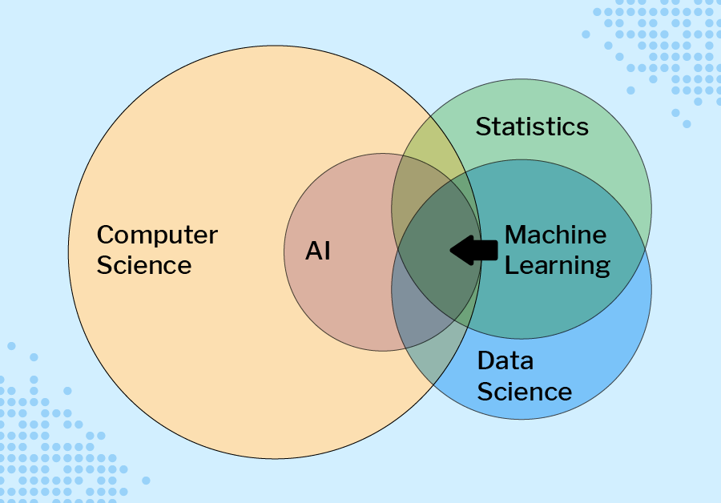

# Week 1 Notes 	ヽ༼ຈل͜ຈ༽ﾉ

## What is AI?
- The aim for AI is simple, it is to automate tasks that require intelligence.
- **Artificial Intelligence:** A computer system able to simulate an intellectual task. The flaw in this definition is how we define intelligence. This definition rules out mechanical processes, such as the lifting and moving, and focuses on the intelligent outcome.
- This definition stems from the way we use this definition of intelligence to tackle artificial intelligence
    1. Identify and define a problem that requires "intelligence"
    1. Work towards and achieve (either full or close enough) a solution to the problem identified and defined
    1. Change the definition of 'intelligent'
    1. Repeat
- The result of this process is that the definition of artificial 'intelligence' is constantly changing as technology gets more advanced. This is what we call the 'AI Effect'.
- The idea of AI has always been in front of computers and technology because the original seed of AI comes from the minds of artists and writers. And computers have then been used to chase and achieve this.
- Turing in 1950 began the hunt of generalized AI which is a computer programmed to be "logic machines" that would be able to deduce the answer to any question like humans do.
    - Main driving force of this was Bayesian model of statistics - which helped machines deal with probability
    - Another driving force has been biologists with the development of neural networks that resemble the way biological neural networks function in our brain.
    - Logic and philosophy helped deal with decision making under uncertainty 
- Companies promised this but couldn't hold to it so they dried up from the 1970's - 1995's called the *AI Winter*.
- In 1980, instead of whole "intelligent systems" they moved to more specialized context form on intelligence. 1990 world wide web produces a wide array of data and gave humans the interaction with that data. As a result, machines were trained to process and identify patterns in this data to support making decisions and to help answer more questions. This made machines appear to be more "intelligent".
- In modern times, the hunt for generalized intelligence has not stopped, but it is no longer the main focus.
### Examples of AI Effect
- Spam filtering
- Google Maps
- Job Resume Filtering
- Spell Check
- Fraud Detection
- Google Translate (language identification)
- Google - Search Engines 
- Smartphone cameras

## Chatbots: Can they pass the turing test?
- I guess everyone wants their programs to pass the turing challenge, why? [His Paper..](https://rpf-futurelearn.s3.eu-west-1.amazonaws.com/Machine+Learning/Resources/ComputingMachineryAndIntelligence.pdf) with the question that has driven all modern thought "Can Machines Think?" --> "Can a computer imitate intelligent behavior well enough to convince someone they were talking to a human?"
    - The proposed test involves one human adjudicator, sitting in a room alone, with access to a computer to enable them to ask questions and receive answers. They will converse with two participants. One of these participants is a computer, the other is a human. The job of each of the participants is to convince the adjudicator that they are the human and not a computer. If the computer can fool 30% of the adjudicators, it is said to have passed the test.
    - The challenge for engineers isn't getting every answer right, but getting some answers wrong by understanding the question enough and give something close in the realm. The challenge for the engineers who want their AI application to pass the test is one of interpretation and imitation. The computer doesn't need to get every question right, but it does need to understand each of the questions to give believable responses. If a human doesn't know the answer to the question, they will still be able to give a specific reply.
        - Adjudicator: Can you write me a poem?

        - Participant: Poetry isn't my strong suit, but I am a fan of Keats.      
- The turing test is hard in that regard of not getting every question right but a soft right. Is this something that humans do well?
- Eugene Goostman is a bot that "beat" the turing test
    - Eugene has been put back online and serves as a great example to show to young people to teach them about chatbots and artificial intelligence. Eugene is designed to exactly mimic a 13-year-old, equipped with a silly sense of humour and the ability to make wisecracks. This also helps mask some of the bot's shortcomings, as it only has to appear to know as much as a 13-year-old child and can therefore skirt around some questions with vague replies. [site.](http://eugenegoostman.elasticbeanstalk.com/)
        - Had to be a 13 year old to battle the limitations of having computers be humans and fooling humans into thinking it does not understand but understands enough context to either skirt or say something wise or say something funny or close.
- I would think the question more is "What is intelligence and is that only inherit to humans?"
### Large Language Models
Large Language Models (LLMs) are a specific type of AI models that have been trained using huge volumes of text (often billions of words). They are designed to generate a text response to a prompt as realistically as if you were speaking to a human by predicting which words come next in a sentence. 
- Chatbot applications such as ChatGPT and Google's Gemini (previously called Bard) use LLMs to provide human like conversations. 

## General and Specialized Intelligence
### Not just General Intelligence
- Searle thinks we should move away from Turing's generalized intelligence (programs can answer any question and perform intelligently in any situation) and focus on choosing a problem first and then creating a specialized AI application to solve it
- Now we have 3 broad definitions of intelligence:
    1. Intelligence — Competence at an intellectual task
    1. General intelligence — Competence in a wide variety of intellectual tasks
    1. Specialized intelligence — Competence in a specific intellectual task
- The new wave of AI research focuses on specialized intelligence where the scope of the task for the AI application is much smaller so the program can be trained to become extremely competent.
### Learning Machines
- The idea is simple: Can we train an AI application that can "learn" and grow more "intelligent"?
- When the concept was first explored, the idea was to have a machine learn how to be generally intelligent: to start from a "baby" machine and have it learn to be intelligent like a human.

## Defining AI and machine learning

- Artificial Intelligence is a product of multiple disciplines blended together. Each of these disciplines are used to train a machine learning model:
    - Computer Science: encompasses all developments of computer hardware or software to solve problems. Machine learning relies heavy on this technique to generate and test algorithms
    - Statistics: Statisticians take data and analyze it to enable informed decision making. Machine learning relies heavily on statistical techniques dealing with probability and chance.
    - Data Science: Involves taking large sets of data and performing analysis using algorithms. Data scientists need to understand data in order to recommend how it can be used to making informed decisions -- the skills involved in this are known as 'data literacy'. 
- [This episode of the fantastic Machine Learning Guide podcast](https://ocdevel.com/mlg/2) will tell me how to look at AI with this question and that is: *How far removed is the original programmer from the output?*
- So if a program is following a set of "if...then" rules, you could say it is not very "artificially intelligent" because the programmer has directly created the rules that determine which inputs should give particular outputs. However, with a machine learning model trained on a set of data, the programmer will have had much less direct control over the outputs of the model when it is given new inputs. This means that if that model produces accurate outcomes with completely new input, you could consider the model to be quite "artificially intelligent".
- In theory and practice AI is two different things wrapped in one:
    1. The research and study of computer intelligence
    1. A program or part of a program that simulates an intellectual task
- One thing in common all AI apps have in common is that they solve problems that involve large data sets, in situations where programming all the rules necessary to process data would be impractical 
    - This can happen when there is a complex problem with so many factors that analyzing the data by hand to identify patterns would be too time-consuming (for example, predicting prices in the stock market), or working out yourself which outcome is the most appropriate is too difficult a task (for example, content recommendations on streaming platforms).
- general = hard AI or strong AI
- specialized = soft AI or weak AI

### Machine Learning
- Consists of:
    - supervised learning
    - unsupervised learning
    - reinforcement learning
    - neural networks
- Combines principles from other disciplines to create extremely specialized algorithms
    - *computer science*: algorithms use computer science principles. Design of those "intelligent" algorithms is inherited from AI
    - *data science*: data used to train and test models is gathered, organized, and cleaned by using data science principles
    - *statistics*: statistical techniques are used inside the algorithms to deal with probability and uncertainty 
### Classification
- Involves us supplying data to a computer for it to then allocate it to a label or a class.
    - Say a retailer wanted a system that would tell wether or not reviews on a product are + or -. To solve this problem, the retailer can use a text-classifying algorithm to look for + and - comments. It does this by being fed data, in this case it would be past reviews and label each one as + or -. The algorithm will use this training data to create a decision boundary to separate the + reviews from the - ones.
    - What is described here is a form of supervised learning as it requires a supervisor (human user) to create classes and to label the training data, so that the algorithm can independently classify new data.
#### Classification types (supervised):
- **Binary Classification:** Involves splitting items into two classes. For example, in our example above it splits the reviews into two classes "positive" or "negative". Email spam filtering is another example of this where email is either classified as "spam" or "not spam".
    -  Imagine you have a bunch of different fruits, like apples and oranges. Binary classification is like sorting these fruits into two groups. Let's say we want to sort them into "Apples" and "Not Apples." So, we look at each fruit and decide if it's an apple or not. If it's an apple, we put it in the "Apples" group, and if it's not, we put it in the "Not Apples" group. It's like putting each fruit into one of two boxes.
- **Multi-Class Classification:** Allows for more than two classes during the labeling process. For example a recycling center needs to categorize everything that comes down the chute. Instead, of labeling things as recycling or not, a multi-class classification model allows for a wider range of classes such as glass, plastic, paper, or cardboard.
    - Now, instead of just two groups, let's imagine we have more categories. We still have our fruits, but this time we want to sort them into different types, like "Apples," "Oranges," and "Bananas." So, we look at each fruit and decide which type it belongs to. If it's an apple, we put it in the "Apples" group. If it's an orange, we put it in the "Oranges" group, and so on. Each fruit goes into one specific group based on what type it is.
- **Multi-Label Classification:** Used for problems where a single data point can have more than one class. For example, a person categorizing images of animals can label a picture of a bear with multiple labels "brown animal", "furry", "bear".
    - This one is a little trickier. Imagine we have some pictures of animals, like cats, dogs, and birds. But here's the twist: each picture can have more than one label, or category. For example, a picture could have both a cat and a bird in it. So, instead of putting each picture into just one group, we put multiple labels on each picture to show what's in it. Some pictures might have just one label, like "Cat," while others might have two or more labels, like "Cat" and "Bird."
- So, in summary:
    - Binary Classification: Sorting things into two groups, like "Apples" and "Not Apples."
    - Multi-Class Classification: Sorting things into more than two groups, like "Apples," "Oranges," and "Bananas."
    - Multi-Label Classification: Putting multiple labels on things to show what categories they belong to, even if they belong to more than one.

#### Classifier Types
- Examples above show a few ways that different types of data,text, and images, can be classified.
    - Images: classifying content of images
        - facial recognition
        - handwriting recognition
        - helping to identify abnormalities on medical images
    - Text: Analyze natural language to identify classes by using longer pieces of text, rather than just picking out common keywords
        - Topic analysis to identify themes or topics present in text
        - Sentiment analysis (detect if language has a positive or negative tone)
    - Sound: classify groups of similar or identical sounds.
        - voice recognition: common example where systems are trained to recognize individual voices or to recognize commands such as in home automation systems. 
        - another example could be to help research scientists identify species of bird present in an area by recording birdsong.
#### Main Limitations of classification (supervised)
- The main limitations of using classification algorithms for machine learning is that creating lots of high-quality(accurate) date takes a lot of time and effort. And that quality depends on:
    1. The existence of the appropriate labels. If the data is fed into the system that does not fit one of the categories, then the prediction will be inaccurate
    1. The training data all being correctly labeled. The more subjective the training data, the more likely any new data will be incorrectly classified
    1. Using a good spread of training data that represents the full range of inputs that the model will have to classify

### Task
Pick one of the types of classification (images, sound, or text), and find another example online of a use for these types of algorithms.

- **Images** = Self-Driving Capability of Tesla utilizes image classifiers to effectively navigate through different driving scenarios.
- Explain the example as best you can: This is a vision based machine learning that is taking in loads of data in the form of images (street signs, road lanes, vehicles, stop lights, pedestrians, etc). It takes all these classifications into account via the image and makes decisions based off of that.
- What classes do you think it identifies? This would identify Multi-Class classification. For instance, one of them would be signs and it would show all the different types of signs.

CHATGPT answer (notes to self: you are a little rusty think more and flush out your thoughts don't rely on yourself 80% and the rest on chatGPT)
- **Images** = Self-Driving Capability of Tesla ✅
- Explain the example as best you can: Yes, Tesla's self-driving technology relies heavily on image classification as part of its artificial intelligence system. Tesla vehicles are equipped with multiple cameras that continuously capture images of the vehicle's surroundings, including other vehicles, pedestrians, road signs, lane markings, and various objects on the road. These images are processed by the onboard AI system, which uses computer vision techniques to classify and interpret the visual data. Image classification algorithms analyze the content of each image and identify different objects or entities present in the scene. This process enables the vehicle to understand its environment and make decisions accordingly to navigate safely and autonomously. ✅
- What classes do you think it identifies? 
1. Vehicles: Cars, trucks, motorcycles, bicycles, etc.
1. Pedestrians: People walking or crossing the street.
1. Road signs: Stop signs, yield signs, speed limit signs, traffic lights, etc.
1. Lane markings: Lane boundaries, arrows, dividers, etc.
1. Road obstacles: Cones, barriers, debris, potholes, etc.
1. Traffic conditions: Congestion, clear roads, intersections, etc.