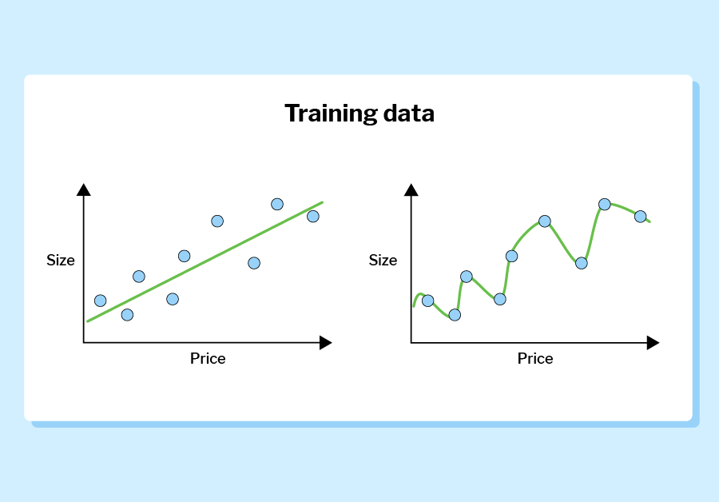

`# WEEK 2: Solving problems using AI / What problems can AI solve? ( •͡˘ _•͡˘)ノð

## When traditional programming is not enough

- When it comes to AI and ML it's better to work out the exact problem you're trying to solve first before deciding upon the technological solution.
- AI and ML can help solve problems that would be too complex or time consuming with traditional programming techniques.
- Machine learning enables rules to be learnt rather than manually constructed in say traditional computer programming.
- A problem can be complex, but if the set of rules to solve them are rather simple than computer programming will work. However, if the rules are a bit more / too complex then ML would come in handy. In short, a problem can be complex but complexity in the problem doesn't mean to use ML it's the complexity in the nature of the rules needed to solve the problem.
    
    **Stargazing**
    ```
    Looking into the night sky on a dark and clear night, you might be able to see a number of stars. Counting all the stars in one area of the sky would be nearly impossible, even if you live in an area with no light pollution. To achieve this, powerful telescopes capture images, and these images are analyzed by a computer program. As stars in the images have similar characteristics, scientists have used traditional programming techniques to create a program that can count the number of stars in the image. This program can be reused to identify new stars in any future images taken by the telescope, and make predictions about how many stars are likely to be in a section of the night sky. Whilst this problem is complex, it's not a problem that needs to be solved by machine learning as there are a small and fixed set of rules about how to identify a star in the image.
    ```
        
    **Texting**   
    ``` 
    Predictive text is a technology that tries to save you time by predicting the rest of the word that you are typing, and the next word that you might want to use. To code all the rules required for this would be far too complex to code manually. Instead, programmers can use machine learning to train a model with millions of examples of people's pre-existing text message conversations. They can also individualize the model by adding into the training data a large number of messages from one specific person, training the model on their style of writing.
    ```
## Overview of Regression, Classification, and Clustering
### Common problems for AI to solve
The following are common problems that are solvable by AI and ML:
1. **Complex identification (classification)**: involves supplying data to a computer so that it can assign a label that data.
1. **Prediction (regression):** The method to make predictions about future events, in which analyzes historical data to make future predictions. Classification chooses a prediction for a label, regression will calculate a number within a range. For example, weather forecasting.
1. **Knowledge organization (clustering):** Is similar to the "human way" of organizational clustering where you have data points and the goal is to group similar data points together based on their characteristics and features. Now instead of the person organizing the data a computer would use a clustering algorithm to find the patterns, groups, and connections between the data points without a human specifying in advance what to look for.
    - (human-simple) example: Imagine you have a big box of different toys scattered around. Some are cars, some are dolls, and some are building blocks. Now, if you want to tidy up and organize these toys, you might decide to put all the cars together, all the dolls together, and all the building blocks together. That's kind of like what clustering does with information!
    - (ML) example: music streaming services could use this to group similar users together to more accurately make recommendations.

1. **Computer vision:** Pretty simple, the main goal is to *see* what is in an image and extract useful information from it. It uses a combination of the concepts above to automate tasks that are achievable through the use of human vision
    - In February 2021, NASA successfully landed their Perseverance rover on the surface of Mars. Computer vision played a key role in the success of the mission. During the landing, a sky crane held the rover in place whilst the lander processed live data from the cameras. Using AI, and with no human intervention, the lander was able to identify objects and potential hazards on the surface until a safe place to touch down was found. Since landing on the surface, the rover has analyzed images to help it safely navigate its way around the Jezero Crater and predict where it is most likely to be successful in its mission to find evidence of past Martian life.

### Discussion
Can you think of a classification or regression problem not mentioned so far in this course where AI or ML could be used to help find a solution?

**Regression** (predictive examples)
1. Purchasing predictions for clothing businesses based on historical data. This would be helpful for companies and merchants.

    **Problem Statement:** Clothing companies plan seasons ahead of the target season to get the desired goods in time and in quantity. An issue with this approach is that they need goods to sell but the issue of over or under purchasing what is needed is an issue. Having a machine model look at historical purchases  

    **Solution with AI/ML:** Having a machine model look at historical purchases via season and see what sold and what didn't sell and help inform merchants what would be the best for the company to lower excess cost and maximize profits
    
    1. Data Collection: Gather historical data on clothing purchases, including features such as date of purchase, type of clothing item, price, customer demographics, marketing efforts, seasonality, and any other relevant information.
    1. Dependent Variable:
    1. Independent Variable:


**Classification**
1. Credit card fraud detection.

    **Problem Statement:** Credit card fraud is an issue in the banking and financial industry. This issue affects both institutions and the customers they represent. Leading to substantial financial loss for both parties involved. Detecting fraudulent activity accurately and fastly protects customers and financial institutions.

    **Solution with AI/ML:**
    1. This data should include labeled examples indicating whether each transaction is fraudulent or legitimate.Gather transactional data from credit card transactions, including features such as transaction amount, location, time of day, merchant category, and any other relevant information. 

## In Depth: Regression - Predicting a Numerical Data
(˵ ͡° ͜ʖ ͡°˵) this statistics stuff makes me happy.

- Regression: This is used when the desired prediction is a number. It uses data from the past to attempt to define the relationship between the available data (inputs) and the value to be predicted (output).

- Input = (**independent variable**): Available data. (x-axis)
- Output = (**dependent variable**): predicted output (which is a number). (y-axis)

- Simplest type of regression is linear regression which analyze data and plot a line of best fit that best expresses the relationship between the two variables.

- The line will tell you two important things: the weight of the input and the prediction for when the independent variable is 0. The weight of your input shows how much it affects the output, and in what direction: it can be positive or negative. If you only have one input, the weight of the input gives the slope of the line of best fit. A good analogy for weights is the count of items on a receipt.


The count of each item is the input and the price will be the weight. To get the total price, you multiply each item count (input) by the price (weight). The weight is also called the coefficient. The weight of an input can give useful insights: the higher the weight, the stronger the link between that input and the output.

The regression algorithm will also calculate a y-intercept — this is the value that the model would predict if your input was 0.

All of this together gives you the equation for a line, which is usually written as

**y = mx + c**

Term | Description
--- | ---
y | the predicted value
m |the weight of the input variable
x | the input variable
c | the y-intercept


Coefficient | y-intercept
--- | ---
-14.61 | 182.36

These values reveal that a property that is 0 miles away from the Empire State Building should be rented for $182.36 and for every mile you travel away from the building, the rental drops by $14.61.

There is no way to get a line to go through every piece of data you have. For each point, the distance to the line (up or down) is called the error. The goal of the regression algorithm is to make the sum of all the errors on the graph as low as possible by adjusting the weight to find the optimal weight.


### Multiple linear regression
You can also use regression on problems with multiple independent variables, and this is where ML is really helpful.

When you have more than one input variable, the algorithm will work out the weights for each of them. Machine learning is used to "learn" by adjusting weights to reduce the error as much as possible, to get to the optimal weights.

In the example above, you might decide that location is not enough to accurately predict a price. You could also consider the number of rooms or the maximum length of a rental to help you make better predictions.

### Polynomial regression
Linear relationship means that adding the same amount to an input will always result in the same increase of the output

This is where polynomial curve comes in because relationship might not always be linear. These are another type of equation, which typically uses a power of **$x(x^n)$**.

Adding some value to the input does not always result in the same increase to the output


### Discussion
1. Think of another problem you could use regression on. If you cannot think of one, think about predicting the temperature.
    
    **Identifying variables:**
    - Trying to predict the temperature and a variable that I believe will influence it
    - I would set my independent variable to be the months of the year (season)
    - The dependent variable (inputs) would be the temperatures historically for each day of the month plotted for a year 
    
    **Data Collection:**
    - Data would be historical data points of the season and the temperature over the years

    **Data Processing:**
    - Clean and pre-process the data: Handling missing values, removing outliers, and etc.

    **Model Selection:**
    - Polynomial Regression because temperature may not be directly related to season with factors such as global warming and etc (non-linear). There are factors that could make it fluctuate over time. **$x(x^n)$**.
    - I would test it against multi-linear to also compare

## In Depth: Knowledge Organization 
Used for organizing large / huge sets of data to find groups and connections that we as humans may not identify to better make decisions.

**Knowledge Organization**: groups similar data together to better show the relationships in the data set. 

### How data is organized - two types:
- Association: will find links between data points. Specifically, between features and data points. A Feature is a singular variable in the data and data point is a collection of features.
    - relationships between features and data points in a data set are called association rules. They create groups in the data that are linked by common features. 
    - in association one data point can be associated to many groups.
    - ex: medical records (data set) might spot the patients (data point) with heart problems (feature) are also likely to have symptoms of malnourishment (feature).

- Clustering
    - Can be either exclusive or overlapping. Clustering algorithms will give percentage values for these points, representing how closely they fit together.
        - exclusive: a data point can only belong to one cluster
        - overlapping: a data point(s) can belong to two or more clusters
    - Clustering algorithms will group similar data points together to form "clusters". These algorithms examine the data points as a whole and will group them based on how similar they are, by comparing multiple features of these points. This splits your data into more understandable chunks. 
    - Examining the size of the clusters can tell you a lot about the makeup of your data.

     *exclusive*

     *overlapping*


### Netflix — the perfect example?
<details>
<summary>Netflix Example</summary>

Netflix is an online streaming site, serving TV shows and movies to over 195 million users in 190 countries. They have huge amounts of data about the content they provide and the users who watch it. They also invest heavily in AI and ML to make the most of all that data.

Netflix uses ML in almost all facets of its business, but behind it all is a well-organized knowledge base.

Taste communities
Viewers are grouped together in overlapping clusters that Netflix calls taste communities based around the type of content they like to watch.

Inside Netflix, they use thousands of labels to mark content. These include not only the format of the show, such as "TV sitcom", "film", and "documentary", but also more details about the content including its genre (such as "sci-fi", "romance", or "action"), the actors involved, and specific plot points. Netflix also have huge amounts of data about the users themselves, from the content that they watch, how long they watch for, and even the type of device they use. The company uses all of this data as inputs for their knowledge organizer algorithm, which then groups users into taste communities with other users who share the same watching habits.

Netflix has created around 2000 different taste communities, meaning they are able to target these groups specifically with their content marketing. In some cases, this has led to criticism of Netflix tailoring their marketing in a way that misleads their viewers as to the content of the show.

What do they do with that knowledge?
Netflix takes advantage of the knowledge organization of its users to personalize their experience using the app.

Recommendations — Netflix estimates 75 to 80% of its viewing time comes from in-app recommendations. By using your personal taste community affiliations, Netflix is able to show you content that others who share your tastes have enjoyed.

Artwork — Another personalization is the artwork that Netflix uses for its shows. The artwork is scraped from video frames in the content and the options are shown to millions of users. Once they know which art generates the most clicks within your taste community, they stop experimenting and only use the successful thumbnails.

Content creation — Netflix has commissioned content based on their taste communities. If they can see a large community who are interested in romantic comedies and another who love fantasy movies, they can commission a new show to serve both those audiences.
</details>

### Discussion
1. What content recommenders similar to Netflix do you use most often?
    - I use Spotify, in particular Spotify's radio feature that gives me songs similar to the one I am listening to.
1. What features of their content do you think they use to group their users?
    - I think they use a similar approach to netflix with taste communities
        - format of the music (genre, speed, voice gender, length, mood)
        - artist appearance
        - listen history
        - device used
        - geographical location
        - skips & replays
    - I think they form taste profiles of the user based on the factors above

## Data Science 
	(҂◡_◡) ᕤ A little tired, enjoying it still!

Data Science Extracts meaning from large data sets in order to gain insights to support decision making.


In 1854, the physician John Snow believed that the the outbreak of cholera in the Soho area of London was being caused by a contaminated water supply — contrary to the commonly held belief that cholera was caused by 'bad air' in the area. To help prove his theory, Snow mapped the deaths from cholera in the area. The map clearly showed the deaths were centred around Broad Street and residents there were getting their water from the pump on this street. By visualizing the data in this way, he was able to convince the local council to disable the water pump. It was widely recognized that this visualization helped to save many lives.

### Relationship between data science and machine learning
- Data science and machine learning are separate but interconnected disciplines. Data science can utilize machine learning when analyzing data and machine learning relies on good quality data to optimize the results machine learning algorithms can produce.

    

- Investigation Cycle (PPDAC)
    - Problem: Clearly defining the problem that intends to be solved and where one identifies what data will be needed for the project
    - Plan: Get into the detail of how the project will be conducted by answering questions such as:
        - Where will the data come from and how will you collect it?
        - Will there be enough data to be able to adequately investigate the problem?
        - Where will you store the data?
        - What are the ethical considerations? ⚠️ ⚠️ ⚠️ ⚠️ !!
    - Data: Collect and prepare data. If the data is not cleaned properly the results/outputs will be unreliable. Data has the biggest impact on the reliability of the algorithm. An algorithm is only as good as it's data.
    - Analysis: This is the stage that makes sense of the data. This is where the machine learning algorithms are used by data scientists, if the project requires for it. Scientists feed data into the algorithms to identify patterns, trends, and correlations. Visual representations 
    - Conclusion: Understanding whether or not the data answered our original question / problem:
        - More data is needed from different data sets to confirm the hypothesis
        - New questions have arisen from the answers

## Data Collection - is it ethical?

### Ethical Considerations
The ethics of data collection and how it is subsequently processed needs to be considered by everyone involved in projects involving data, and that includes machine learning projects. Even in the absence of a legal framework, you still need to think about questions such as:

    - Where will the data be sourced?
    - How will the data be sourced? - What methods of collecting data should be used?
    - Is consent needed?
    - Who will store, own, and control the data?
    - Are all your actions transparent and open to inspection?
    - Controversial examples of data collection often involve situations where personal data is collected and processed.

#### Smart City Example
A smart city is a city that uses electronic devices including sensors to collect data and to use it to improve operations and services in the area. Examples of benefits to those living these cities include:

- Real-time traffic management, i.e. controlling lights to reduce travel times and emissions
- Smart bins relaying information on how full they are so that they only get emptied when needed
- Street lights that turn on only when needed, resulting in energy savings


Data can be fed into machine learning algorithms to help plan for sustainable development of the city. For example, by recording footfall, traffic, and air quality from around the city, machine learning can be used to help identify new routes for public transport.

In principle, the collected data appears to be being used for ethical purposes as the aim of a smart city is to improve the lives of those who access its services. This doesn't mean that the people collecting and using the data don't need to factor in ethical considerations, however. Stringent controls need to be in place over who has access to the data and to make sure it is only being used for the purpose the citizens have agreed to.

### Laws
Some governments have passed laws to govern the use of identifiable data relating to their citizens, such as the General Data Protection Regulation in the EU and the Data Protection Act in the UK. These laws aim to control how organizations collect and use personal data, as well as outlining the rights their citizens have over how their data is used.

### Discussion 
Consider the following statement from [Aspects of Data Ethics in a Changing World: Where are we now?](https://www.liebertpub.com/doi/full/10.1089/big.2018.0083)

- I agree it is simply put like this, in terms of ethical regulation you are only as strong as your weakest link. Without a unified cohesive regulation country to country the weakest link on data privacy will be exploited and bring down the standards for everyone else. For instance, what is from stopping companies to just setting up shop in a country that has relaxed privacy laws and regulations to conduct their business?

## Data Preparation
80% of data scientists job involves [cleaning and preparing data](https://visit.figure-eight.com/rs/416-ZBE-142/images/CrowdFlower_DataScienceReport_2016.pdf). An algorithm is only as strong as the data put into it. The more accurate the data the more reliable/accurate the machine learning algorithm will perform. The more accurate predictions the AI will make.

## Data Cleansing
To get a better idea of what is involved, take a look at the following data set concerning animals in a zoo. The data set only shows a small number of animals in the zoo and therefore is only a sample of a larger data set. A zoo might take advantage of a machine learning algorithm to try and predict the age of new rescued animals entering the zoo where the age of the animal is not known.

[link to full data](https://rpf-futurelearn.s3-eu-west-1.amazonaws.com/Machine+Learning/Resources/Data+cleansing+exercise+-+Zoo+animals.pdf)

Even without any machine learning, a simple graph showing average heights of the animals highlights a potential issue.


According to this data meerkats are taller than lions.

In addition to this, there are a number of other problems with the data set that would lead to inaccurate predictions if you used it to form a machine learning algorithm:

- Missing data
- Duplicated records
- Invalid data (outside of normal range)
- Inconsistent format of the data (different date formats in this case)


### Inspected Data Set
Each data set is different and will require a different cleansing program. Humans need to inspect data sets initially so that a programmer can write software to clean the data specifically for the data set they are working with. Below are some of the potential issues to consider:

#### Missing data
A machine learning algorithm would treat a null value as if it was deliberately there and use it as part of the learning process. Depending on the data and what the purpose of the machine learning algorithm is, you need to make a decision as to whether or not the whole record should be ignored.

#### Duplicate data
Duplication often occurs during data collection. It might happen because of a data entry error, or when data sets from multiple sources have been combined. Removing duplicates reduces the processing time as it avoids the same data being processed twice.

#### Irrelevant data
Data sets need to be inspected to decide what data is needed. Only data that is relevant to the problem should be used. Irrelevant data could not only cause the machine learning algorithm to output predictions with a higher rate of error, but it will also increase the processing cost.

#### Data formatting
Sometimes data might have been entered using different formatting standards. Date is a common example as countries have different standards. The UK uses DD/MM/YYYY, North America uses MM/DD/YYYY, and many other countries use YYYY/MM/DD. Sometimes the date might even only use two digits for the year. You would need to resolve these issues if this data is relevant to the predictions the machine learning algorithm needs to make.

#### Revisiting the data source
The more clean data you have to train your model the better. In some of the cases above it might be an option to look again at the original data set to see if some of the problems such as missing data can be resolved. The error could have been caused by a corrupted import of the data, or a typo by the person who entered the data.

### Automation
As mentioned above, the process of preparing data doesn't have to be a manual job. In fact with a data set of any significant size, it would be far too time consuming and prone to error for a human to do.

Programmers can write programs to automate the process for you once you dictate the rules you need it to follow, such as what format you would like the data to be in and when to delete data records with empty data. Data preparation is a job that could even be done by a machine learning algorithm that learns from how the mistakes are being corrected and is able to clean any new data sets.

### Discussion
What do you think are the most common causes of unclean data?
- Human Error (manual and programmatically)
    - lead to formatting errors as well
- Duplicate Entries
- Missing Values

# Gathering Your Own Data for Machine Learning

[link to gather data](https://docs.google.com/forms/d/e/1FAIpQLSfqoPqhCO46Nz6zizrnj436BX9k-1OHDoZ0QtyBuJ3vFF1O4w/viewform)

### Survey should contain:

- One multiple choice question for participants to choose their favorite genre
- Five scale questions (ranging from 1 to 10) for them to rate the movies

### Cleanse Data
An issue encountered was survey participants who did not see the movie leaving it blank. In this case, treating empty fields as 0 as this will force the model to ignore those fields when making predictions

*Note: You will need some testing data for later. Remove one set of answers (a row in my spreadsheet) corresponding to each genre and save them separately.*

### Create a new machine Learning Project
 [Machine Learning for Kids](https://machinelearningforkids.co.uk/)

-   [Created Model](https://machinelearningforkids.co.uk/#!/mlproject/auth0%7C662678dae61e3f4477401c8e/4fac7760-00b8-11ef-ab3e-35193c14d54f)

## Bias and Variance
Our aim in machine learning algorithm is for it to be as accurate as possible to predict outcomes. 

### Prediction Bias
**Bias** is a measure that shows how far away the average predictions are from the average of the actual data labels. In simple terms, if the algorithm cannot reflect real world relationship between the input data and what the algorithm is predicting, the mode is said to have bias.

#### Example
Predict a house in a certain area based on the size

- Graph (left) uses linear regression to fit the data. The line doesn't fit the data perfectly and the algorithm/model doesn't have the flexibility to fully represent the relationship between the two variables. This model has bias.
- Graph (right) uses a line that fits the data perfectly. It has no bias as the fit line is flexible enough to accurately reflect all the data.

### Variance
In the example above we compared two models in which the lines are created using the training data. This graph below shows how they perform when presented with test data.


- The line on the left hasn't been overfitted and is now outperforming the model on the left with lower bias

**Variance** is calculated by taking the error of the training data and comparing it to the error in the test data. The graph on the left still has bias but it has low variance, as the error is similar if not better for the test data than it was with the training data. This means that whilst there is still error, it is more predictable how this algorithm will perform on future data sets.

The graph on the right represents a model that has paid too close attention to the training data. This is called **overfitting** because it models the training data too accurately. As a result, it will be less likely to accurately model future data.


### Sweet Spot
**Ideal Goal =** Low Bias and Low Variance

Unfortunately, in reality, this is something that is very hard to achieve and the aim is to find a trade off between bias and variance.


    One method to find this balance is to monitor the learning process of your model. As the model learns, the error will decrease for both the training data and the test data. There will, however, be a point where the model will become overfitted to the training data and the error on the test data will start to increase. You want your algorithm to stop learning at the point just before the error on the test data starts to increase. This is commonly known as the sweet spot.


    Another way in which overfitting can be avoided is by splitting the training data and test data into different combinations of sets, to train several different models. You can then pick the model with the optimum accuracy. There might be a temptation to use all of the available data as training data; however, it is important to always keep a good proportion of the data aside to test the model. Using all of the data as training data is much more likely to lead to overfitting.

### Ethical Bias
Prediction bias can lean an algorithm outputting a prediction that has ethical bias

[See Story](https://www.theguardian.com/technology/2020/sep/21/twitter-apologises-for-racist-image-cropping-algorithm)

### CHATGPT help on further understanding bias and variance:

Imagine you have a toy robot, and you're trying to teach it how to catch a ball. Now, the robot is pretty smart, but it has some quirks.

**Bias:**

Bias is like having a robot that always throws the ball in the same direction, no matter where the ball is coming from. It's kind of stuck in its ways.

So, if the robot always throws the ball a bit to the left, it might miss catching balls that come from the right.

In machine learning, bias happens when our model is too simple and always makes the same kind of mistakes, no matter what data it sees.

**Variance:**

Now, let's say you have another toy robot, but this one is a bit unpredictable. Sometimes it throws the ball perfectly, but other times it throws it all over the place.

This robot is like a scatterbrain! It's all over the map and can't decide how to throw the ball each time.

In machine learning, variance happens when our model is too complex and changes a lot with different sets of data. It's like having a model that overfits the training data and can't generalize well to new, unseen data.
So, to have a really good catching robot (or a machine learning model), we want it to have just the right amount of bias and variance. We want it to learn from the data without being too stuck in its ways (low bias) or too all over the place (low variance). We want it to catch balls from any direction, just like a pro!

### Discussion
Is the problem with this image-cropping algorithm due to bias or variance?
- It is due to Bias. It's not missing the mark sometimes and hitting it other times - which would be variance. According to the article it is behaving consistently just the same way and the wrong way.

How do you think Twitter could address this problem?
- Invest in more people of color and women and minorities that are professionals in data science and ML and computer science to work on these models because if they are primarily made by caucasian Americans they will not more than likely know the bias they and inviting into the predictions. They openly get in front and work on where the issue lied, was it in the data? or was it in the algorithm for the model? Where was the bias introduced. Because a model is only as good as it's data. Then address the issue and move forward but I would roll that model back until they have the right answers to move forward in a culturally positive manner.

## Bias in Recruitment 
