# Week 3 Notes	╭(ʘ̆~◞౪◟~ʘ̆)╮

## 3.2 - How Machines Learn

- [ ] Explore the process used to create extremely specialized AI applications.

### What is Machine Learning?
    A set of tools and practices that use data to train an AI algorithm to produce a more accurate output. Rather than programming tasks directly, it is a process where loads of input data is used to produce a solution for a task that can pick new unseen outputs.

The end product of machine learning is called **a model**. When the learning has finished one **deploys** the model into an AI application.

### The Learning Process
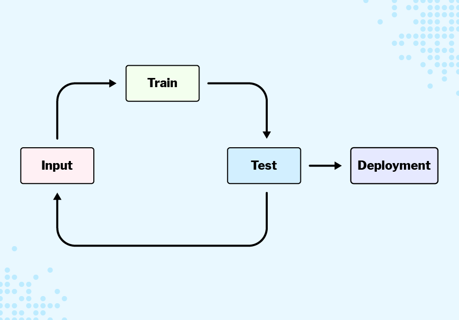
1. **Input**
- The very first step is to gather the relevant data and cleanse it using data science. 
- Can then split the data into training and test sets. Do not use all data in training set because this runs the issue of overfitting.
2. **Train**
- The model will repeatedly analyze the training data and attempt to produce the desired output, adjusting as it goes to become more accurate.
3. **Test**
- During testing, try the model using a set of test data, which is data that you have not passed to the model before, either while training it or in previous tests. If a model is very accurate for the training data but fails to produce accurate results for the test data, then the model is **overfitted**. 
- When you have not trained the model sufficiently, it will be inaccurate on both the training and test data — then the model is **underfitted**.
- Machine learning models will usually include a **confidence score** with each prediction. You can use these to gauge how well the model was trained.
    - A good confidence score during the training phase typically means that the model is consistently making confident and accurate predictions on the training data. Generally, you'd want high confidence scores, ideally close to 100%, indicating the model is very confident in its predictions.

    - On the other hand, a poor confidence score during training could mean several things:
        - Low Confidence: The model is consistently unsure about its predictions, indicating that it's struggling to learn from the data.
        - Inconsistency: The confidence scores fluctuate a lot, suggesting instability in the learning process.
        - Overfitting: The model has learned to memorize the training data rather than generalize from it, leading to overly confident but inaccurate predictions on unseen data.
        - Underfitting: The model hasn't learned enough from the training data, resulting in low confidence scores because it's uncertain about its predictions.
4. **Repeat until Sweet Spot**
    - If you are not happy with the results, you can put the model back through training. When you do this, you will often include new examples in the training set to correct errors found during testing.
    - In essence, during training, you're aiming for high and consistent confidence scores that reflect the model's ability to learn patterns effectively from the data.
5. Deployment

### How to train your machine
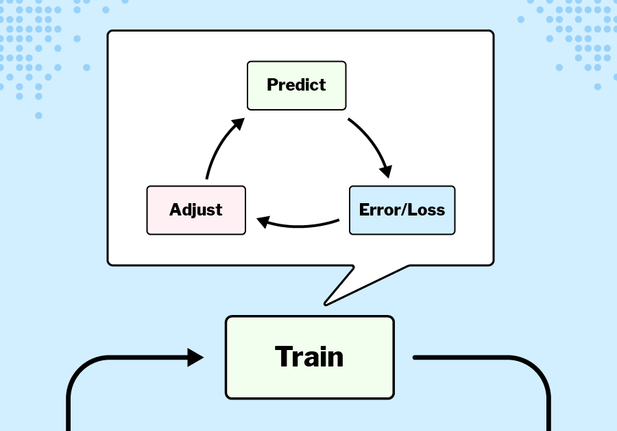

Differ depending on the problem but almost all follow the same pattern:
1. **Predict**
    - The model will identify the patterns in the data and then use these patterns to make a prediction about the outcome for each data point. In this way, it creates rules that it uses to make predictions. To use an earlier example, your rock, paper, scissors model, it would look at each training image and make a prediction about whether it was rock, paper, or scissors.
    - It may not use all the data at one, but instead breaking it into **batches**, and you can control the **batch size** in most machine learning systems. 
    - The model is updated after each batch. The training process would be much slower if the model had to check every error and adjust after every single data point
    - When the model has gone through all the batches, and looked at all of the training data points, this is called an **epoch**. 
    - In a typical training process, there are multiple epochs, as the process is repeated until the error is as small as possible. It will run it multiple times through to find the smallest error possible (I think would be like the line of best fit for instance)
2. **Error/Loss**
    - The process after the model has made its predictions, the algorithm checks how accurate the model was.
    - The model needs some way of scoring itself; typically, this is generated by using an error or loss function that returns a single value showing how different the model's predictions were to the actual outcome.
        - Let's consider a simple example of a binary classification problem where the task is to predict whether an email is spam or not spam based on its content.
        - In this scenario, the model could output a probability score between 0 and 1, where 0 indicates the model is very confident it's not spam, and 1 indicates the model is very confident it is spam. Let's say the model's prediction for a particular email being spam is 0.8.
        - Now, to score the model's performance, we typically use a loss function, such as binary cross-entropy, which measures the difference between the predicted probabilities and the actual outcomes (labels). If the actual label for this email is indeed spam (let's say it's 1), then the error for this prediction would be calculated using the binary cross-entropy loss. 
        
        - 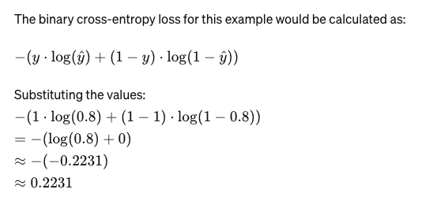
        - So, the model's loss for this prediction would be approximately 0.2231. 

3. **Adjust**
- Before the next iteration, the algorithm will adjust the model's rules. The size of that change will be determined by the amount of error and the learning rate you set before training starts. The learning rate determines the step size the algorithm uses to change the model's rules; the higher the error in the iteration, the more steps the algorithm will use to adjust the model.
- During training, the goal is to minimize this loss function across all predictions in the training dataset. A lower loss indicates that the model's predictions are closer to the actual outcomes, which generally corresponds to better performance. Conversely, a higher loss would indicate poorer performance.
- A large learning rate will make the training process quicker, as large steps quickly lead to plateaus in the amount of error. However, finding the perfect sweet spot requires fine adjustments, so although it may take longer, a lower learning rate tends to lead to a more accurate model.

### Knowing when to stop
There are two factors that will determine when you stop the training process:
1. The model's accuracy
1. The number of epochs

Eventually, your model will reach a point where a round of adjustment only leads to a negligible change in the error. You might also set a maximum number of iterations (or epochs) after which you will stop training.

### Key Terms
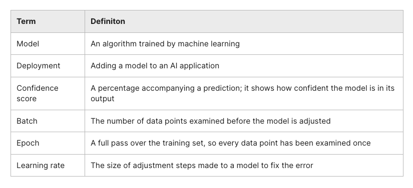

## 3.3 - Introduction to Supervised Learning
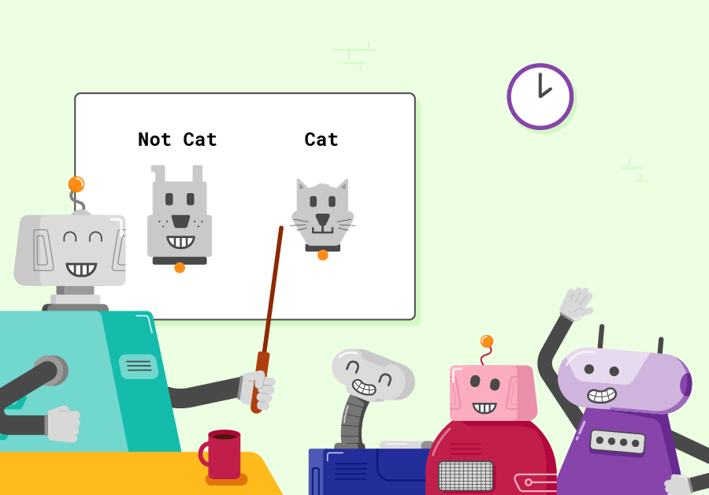

Supervised learning is a form of machine learning where the model is trained using data for which the correct output is already known.

*Classification and regression* are examples of supervised learning. Both make predictions based on a learning process where input data has been labelled with correct output/class.

### What is supervised learning
**supervised** comes from the idea that performance is being monitored and corrected by providing feedback

    Imagine a maths teacher who provides her student with a set of numbers to use as a starting point and also provides the answer they need to arrive at. What she doesn't do, however, is provide them with the formula they need to get to the answer. The student then spends time working out what the formula is. When the teacher provides a new set of numbers, her student applies the formula to work out an answer. The teacher then provides the student with feedback as to how accurately their formula performed. If the formula worked, great, it can be tested on a few more examples to make sure it still works. If not, then the formula is tweaked until it works.

The supervision element is done partly by a human who labels the inputs with correct class/output, but the monitoring and accuracy and tweaking of the model is performed by the algorithm itself

Thinking back to when you created a rock, paper, scissors algorithm, you provided the input data in the form of images. You also labelled each image as one of the three classes, providing the correct output you would like your model to provide if similar images were used as inputs in the future.

At the end of each cycle of learning (batch), the model compares the predictions it produced to the correct answers provided by a human. The difference between them is called the 'error'. The model will tweak its rules to minimize error. It will then repeat this process until the error is below a maximum value that you set at the start of the training process.

In traditional programming, it is the programmer that is responsible for the algorithm. In machine learning, however, you are allowing the machine to create the algorithm needed to solve the problem by itself.

When supervised learning is used, the algorithm created from the learning process is known as the **mapping function**. 

    y = f(x)

- y is the predicted output
- x is the new input data

Once created, you can apply the mapping function to new inputs to give predictions for the output.

In supervised learning such as classification of images you won't know specifically how the function f(x) works, as the machine is creating the algorithm itself. In regression, the model uses a less generalized mapping function, which is the same as the equation for line:

    y = mx + c
- y is the continuous variable
- mx represents the input modified by a weight
- c is the y-intercept - the output when the input is zero

### Challenges of Supervised Learning
Supervised learning requires a ton of quality training data for an effective learning process to take place.

[ImageNet Roulette](https://excavating.ai/)
    
    A project called ImageNet started in 2007 with the aim of providing a vast dataset of labelled images that can be used by organizations to train their machine learning systems. ImageNet used crowdsourcing (enlisting the services of a large number of people via the internet) to create labels and label images in the dataset. Within 3 years, these people had labelled more than 3 million images with the objects (including humans) that appeared in the image.

    A project named ImageNet Roulette built on this to allow users to upload their photos to see how ImageNet would classify them. The model used for this was trained on images in the person category within the ImageNet database. Soon after launching, users started to report that offensive results were being returned. One such example included children wearing sunglasses being labelled as "failure" or "loser".

Good idea in theory, but having people upload and label the images because it can give you lots of data but there is not a way to control the quality of the data.

### Supervised Learning Algorithms
- Decision Trees
- k-Nearest neighbor

## Decision Tree's 	(╯°□°)╯
Used to solve classification and regression like problems in Machine Learning

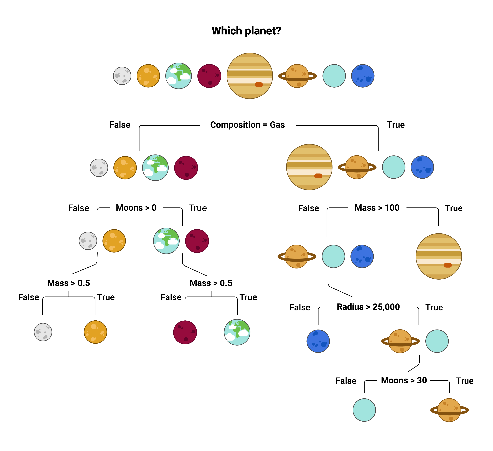

Machine Learning Algorithms and historical Decision Tree's use binary decisions (ones with true and false outcomes) to split the data until they reach the final result. **Key difference is the algorithms are applied to larger datasets and they work out the most efficient splits of data to be able to make a prediction in as few steps as possible**

Uses justifications of binary justification to get all binary ideations down to one form of "truth"

### Decision Tree Algorithm
Tree like flowchart with a hierarchal structure. The starting point like a tree is yes, the *root*.
- **ROOT**: all of the data points of all the pieces aggregated data that will flow upwards (or downwards). Spilling over into *decision nodes* based on binary goals.
- **DECISION NODES**: (づ｡◕‿‿◕｡)づ (hugs). Binary goals will use a decision node to branch off more data using more binary questions until it reaches the ultimate end - *a leaf*
- **LEAF**: The algorithm will continue on and on is a little life forms as possible to reach it's **leaf/terminal-node** which is practically the end of the tree. A Decision that allows us to take our data and make heads or tales of it.
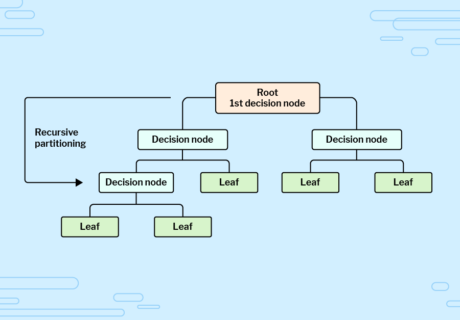

### Workout How to Separate Data at a Decision Node
You need to have something in an algorithm that just knows when it ends. But in order to know when that ends you must know where it splits. It splits at places that machine learning folks like to call information gain and Gini impurity. It is a strategy for machine learning algorithms to tell how the data should further be separated to find a means to the end - a leaf or "terminal-node". 

In textbook terms, the place to decide the optimal split from a root node, and subsequent splits.

1. [making decisions with trees](https://medium.com/swlh/making-decisions-with-trees-559c8db5af59)
1. [Gini impurity](https://towardsdatascience.com/gini-impurity-measure-dbd3878ead33)

#### Making Decisions with Tree's
This article breaks down decision trees further, down the road we will work through an example that is a real world problem solved by using a decision tree.

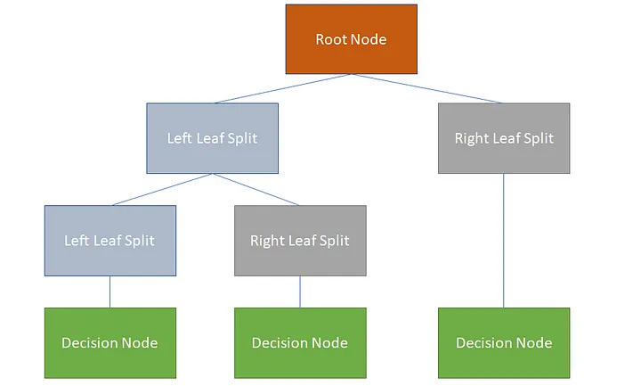

The decision we will work through is simple one: *Should I go to work, or not?*

- [sample-data](making-decisions-with-trees/SampleData.csv) was created with a python script using pandas and numpy to fill arbitrary data into columns and rows of 8 individuals.
- [final-decision-tree-py](making-decisions-with-trees/create_decision_tree.py) is a walkthrough coded problem where we use Trees to make a decision if we should go to work or not.

### Classifying Data with Tree Example
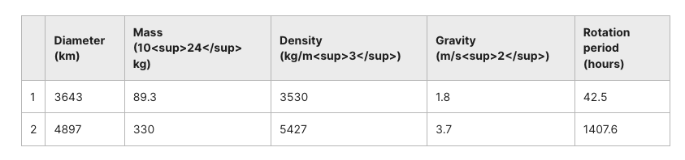

1. It would first split the root node at the top to be true because gravity is less than or equal to 2.7. It would then split it as a `samples = 6, value = [6,0], and class = Moon.` Because the rotational-period is not less than or equal to -72.1
1. It would be split false off the root node because gravity is not less than or equal to 2.75 (3.7). Therefore, it would fall in the false category and be `samples = 6, value = [0,6], class= Planet`

## Unsupervised Learning
Machines to learning researchers want computers to learn to spot similarities and difference in data on it's own. The aim of unsupervised learning is to find the data points that are similar and to tell the user what the similarities are.

Makes 2 assumptions:
1. There will be common characteristics that can be used to compare every data point. 
1. Some data points will be more similar than others

All machine learning projects follow this same cycle:
1. Predict
1. Calculate error
1. Adjust

### k-Means clustering
Splitting your data into a number of clusters (k) that is set at the beginning. *You might also hear k called the number of "centroids", which just refers the point at the centre of a cluster.*
- Once split in k-clusters the algorithm will at random select three data points to act as the initial centroids of the cluster
- For every point on the graph, the algorithm will measure the distance on the graph to each of the centroids.
- The distance is a measure of how "similar" the data point is to the centroids. Each data point will be classed as part of the cluster whose centroid is closest to it; you can call this one round of clustering.
- Next, the algorithm finds the mean of each of the clusters, the actual centre of all of the groups.
- The algorithm then does another round of clustering, using the new mean centres. Here, it is calculating an error — how many points would change groups. If this is not zero, the model is updated to use these new mean centres for the next set of predictions.
- The rounds repeat until there is no change to the groupings. Once this has happened, the final clusters are the model's prediction of groups within the data.
- The algorithm has no way of knowing if the clusters are right, as it has no labels, so the only way for it to evaluate the results is to test the variance in each cluster.

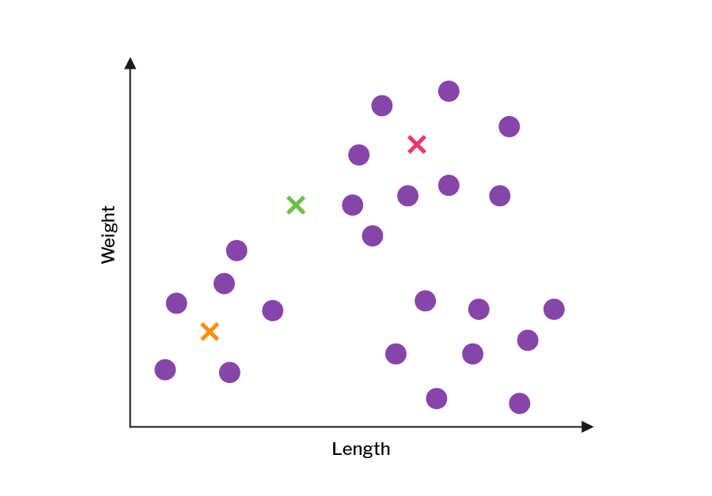
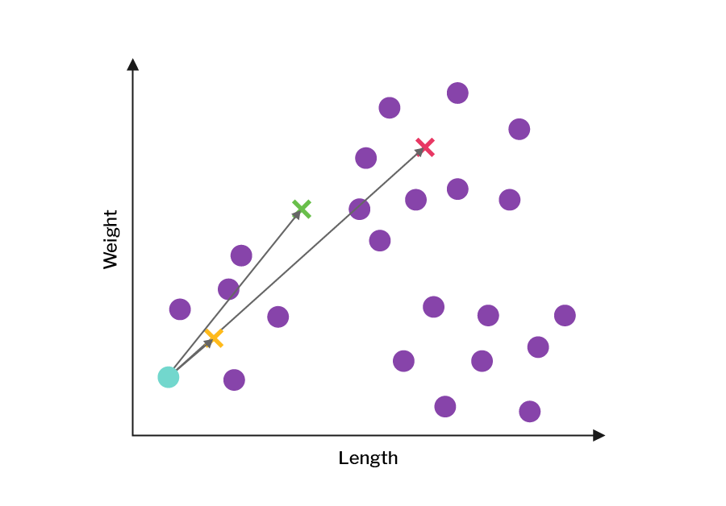
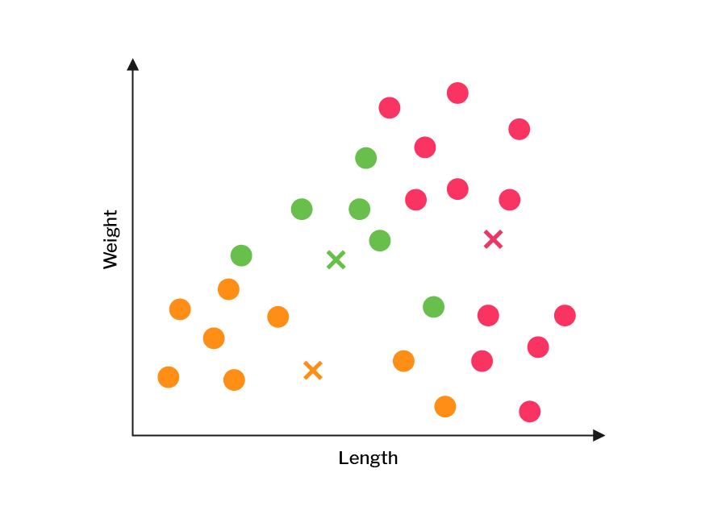
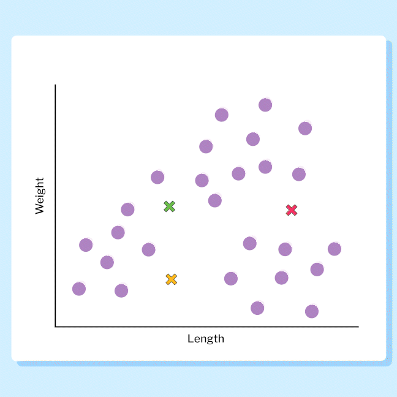
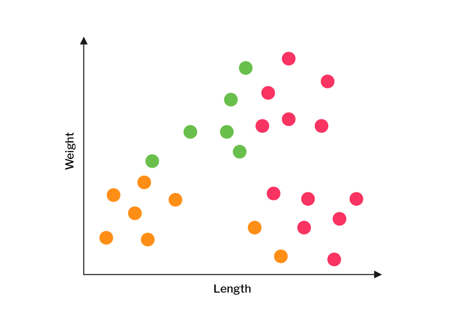

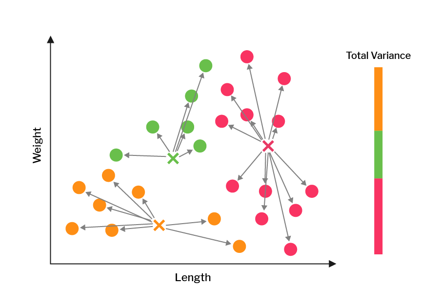

### Comparing the variance
To calculate the variance, the algorithm will measure the distance from each point in a cluster to the mean (the centre) and add them all together. Although the algorithm has evaluated the clusters, it has no way of knowing whether these are the best results possible, so it repeats the whole process again with new random starting points. You can see the resulting clusters from four new iterations of the algorithm below.
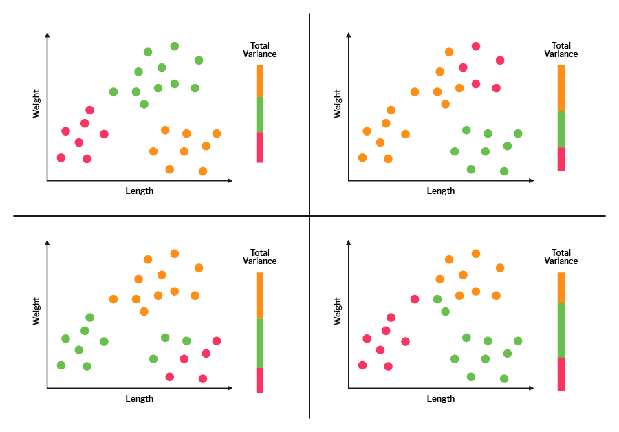

The algorithm will compare the variance in each iteration, and whichever iteration has the lowest total variance will become the final product.

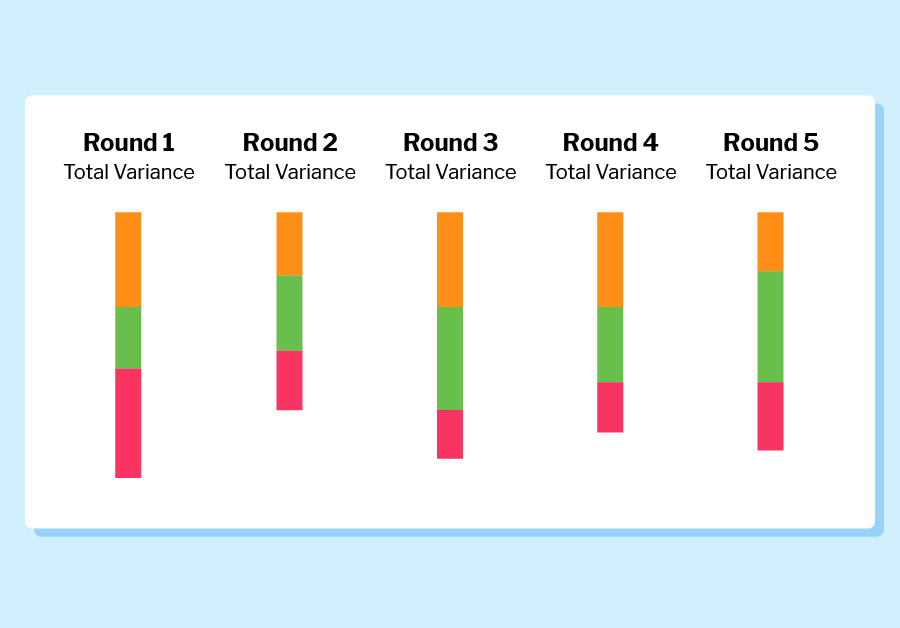
In this case, iteration 2 has the smallest amount of variance, so the algorithm would give this set of clusters as the result.

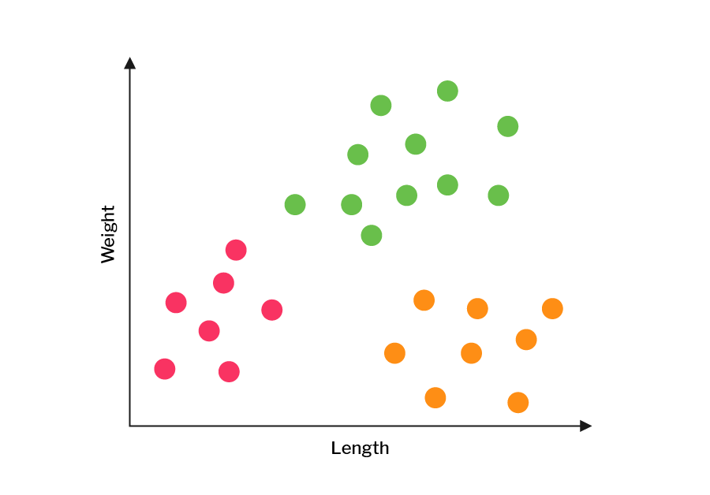

**This is particularly helpful on large large datasets where humans could not possibly discern the groupings.**