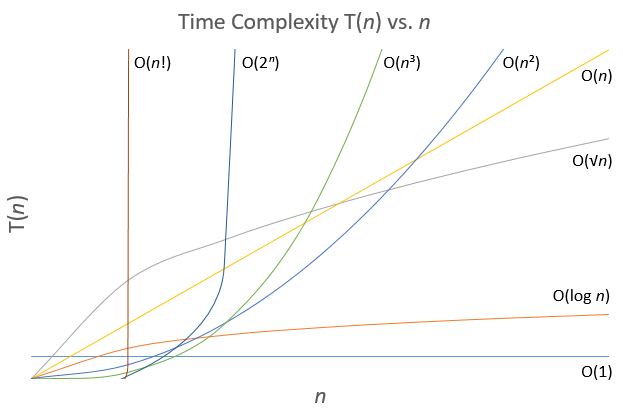
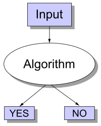
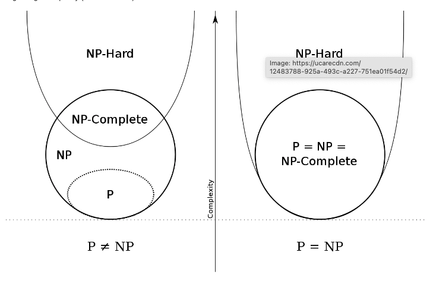
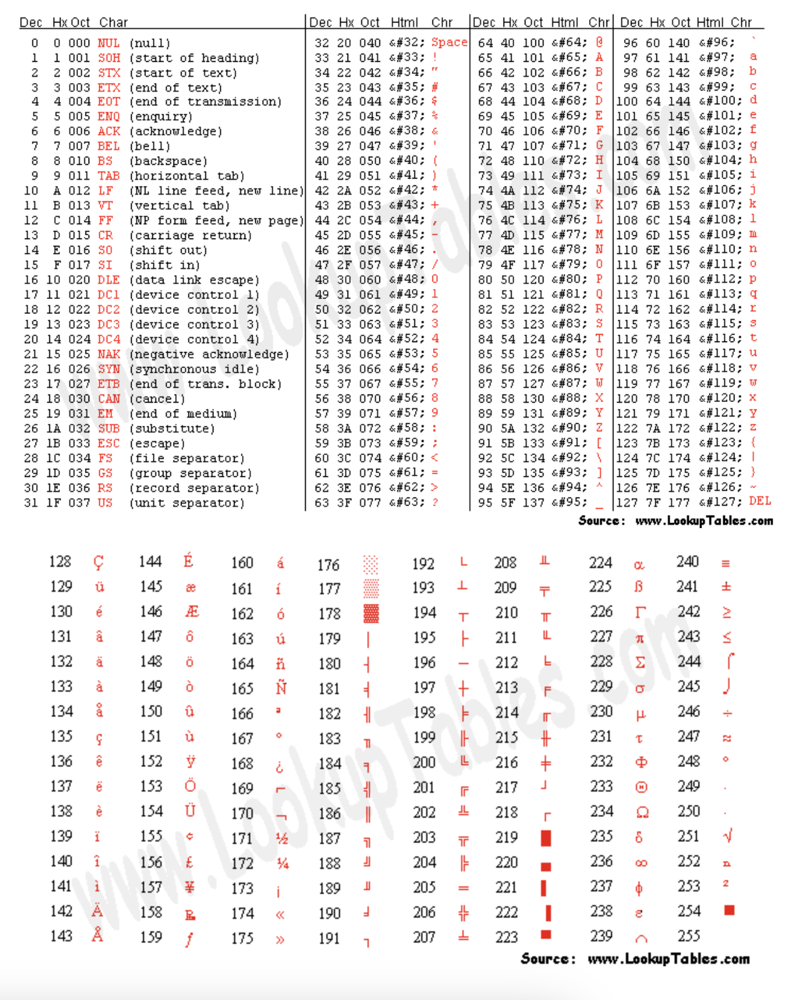
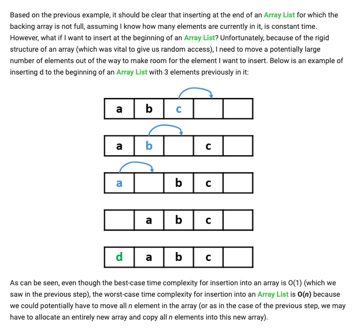
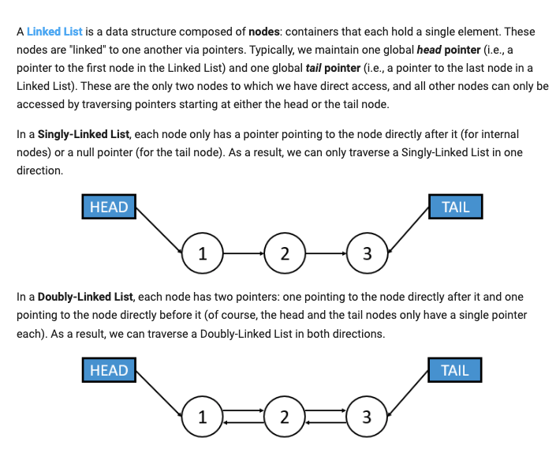

# Introduction and Review

## Time Complexity
In terms of time complexity there are 3 main notations. Big-O is most important because in our terms it gives us a worst case scenario
- **Big-O (Big-Oh)**: **upper-bound** on the number of operations performed
    - f(n) is O(g(n)) as some constant Ag(n) ≥ f(n) as n moves to ∞ infinity
    - f(n) is O(n)
- *Big Theta (Big-ϴ)*: **both upper** and lower bound (Big-Oh & Big-Ω)
    - f(n) is ϴ(g(n)) if f(n) is O(g(n)) AND f(n) is Ω(g(n))
    - f(n) is ϴ(g(n)) if Bg(n) ≤ f(n) ≤ Ag(n)
- *Big-Omega (Big-Ω)*: **lower-bound** on the number of operations performed
    - f(n) is Ω(g(n)) if Bg(n) ≤ f(n) as n -> ∞

An example is we have a list of n numbers and, for each number, we want to print out the number and it's opposite. We want to print the number (1), return the opposite number (1), and then print the opposite(1) = (3n). We will say the the algorithm is O(n) because there exists some constant and we then drop that constant (3) for which the number of operations performed by our algorithm is always bounded by the function g(n) = n. Always bounded by the constant. This is the tightest possible upper-bound. *when we discuss algorithms we always discuss the tightest upper bound, not the most upper bound*.

Another example is we have an algorithm that, given a list of n students, prints out 5 header lines (independent of n) and then prints n student's name (1) and grades (1) on a separate line (2n). Then it will print out 5 header lines (2n +5). The big-oh time complexity will be O(2n + 5) -> O(n) because we drop the constant and drop all lower terms (5 < n as n gets larger).

Easy example is we have an Input: List of n students. Then it will Output: 1. Print the length of list n (1) 2. For each student x: print name (1) and grade (1) == 2(n) + 1. The BigO will be O(2(n) + 1) -> O(n)

Medium example is we have an Input: Flight network of n cities. Then it will Output: 1. Print a header line (independent) 2. For each unique pair of cities it will print city names (2) and print whether direct flight or not (1). We want unique so it would be n(n-1)/2 == n^2/2 - n/2 == 3n^2/2 - 3/2. f(n) == 3n^2/2 - 3n/2 + 3 -> O(n^2). Drop all the constant coefficient and the smaller n's. 

Harder example is we initialize a count variable and then while the input variable n > 0. We will iterate n times and them print out and incrementing count then dividing n/2.

```
foo definition
count = 0 (1)
while n > 0: (n)
    for(int i = 0, i < n; ++i):
        count += 1
    n /= 2 (1)
``` 
n + n / 2 + n / 4 + n / 8 ... 4 + 2 + 1
n (1 + 1/2 + 1/4 + 1/8 ...)
the entire sum approaches (2). The entire f(n) = 2(n). Which is O(n)

Nested loops **DO NOT** always imply n^2 or n log(n). If the inner loop does not depend on the outer loop you can often make that assumption. But with this it does depend on the O(n). So it will be big O(n) time complexity.

## Common Big-O Time Complexities

- O(n!) 
- O(2^n)
- O(n^3) - (polynomial) cubic time - it will double the input size (2) we will cube the operations we have to perform
- O(n^2) - (polynomial) quadratic time - double input size we quadruple the operations we have to perform
- O(n) - algo scales linearly with the input size. double input size would double roughly the operations. twice as big means twice as slow.
- O(n log n) - polynomial time - scale linearly logarithmically on the input size
    - merge sort
    - fast sorting algorithms
- O(log n) - if i double my input size i would double input size i increase the number of operations by constant (just add a single additional check)
    - Binary Search 
- O(1) - the time complexity does not depend on input size. it will take just as long to run the algo.

### Good Time Complexities (polynomial O(n^c))
**"Constant Time"** = **O(1)**
**"Logarithmic Time"** = "Scales/Increases Logarithmically" = **O(log n)**
**"Polynomial Time"** = "Scales/Increases Polynomially" = **O(nk) (for any constant k)**
### Bad Time Complexities (exponential time O(k^n) as n increases it scales horribly && factorial time O(n!))
**"Exponential Time"** = "Scales/Increases Exponentially" = **O(kⁿ)** (for any constant k)
**"Factorial Time"** = **O(n!)**

## Space Complexity (Big Oh)
When dealing with data storage, in addition to worrying about time complexity, we will also be worrying about space complexity, which measures the amount of working storage needed for an input of size n. Just like time complexity, space 

An example - we have n cities and we want to store information about the amount of gas (1) and the time needed to go from j to i (1). n * n == 2 cities. and two variables about itself 2 * n * n = 2n^2 -> O(n).

## Classes of Computational Complexity
### P (Polynomial Time)
Problems that can be solved in "polynomial" time O(n^c) for some constant of c
- Examples: Sorting algorithms like Merge Sort (O(n log n)), and searching algorithms like Binary Search (O(log n))
- Machine Learning Principles: Training linear regression models using the **ordinary least squares method** - which can be done in polynomial time
### NP (Non-Deterministic Polynomial Time)
Problems that can be verified in "polynomial" time O(n^c) for some constant of c
- P is a subset of NP
- Examples: Traveling Salesman Problem (TSP) -- given a route, you can **verify** that it is the shortest in polynomial time
- Machine Learning Principles: Verifying the optimality of a solution in combinatorial organizational problems, such as feature selection in high-dimensional data sets. Understanding the verifying optimality of solutions to such problems, allow us to ensure that our models and algorithms are as efficient as they can be.
    - verifying optimality: checking if a given solution is the best possible solution according to some criteria. in computational problems, this often involves comparing the solution to all possible solutions to ensure its optimal
        - mow: checking if a given solution is the best possible solution by comparing across all possible solutions according to some criteria or rubric
    - combinatorial organization problems: problems where the goal is to find the best combination or arrangement of elements according to certain rules and constraints. examples are TSP, Knapsack Problem, and Feature Selection in machine learning. these problems often have a large number of possible combinations, making them computationally challenging because they are O(n^c).
        - mow: a problem that finds the best combinations of elements according to certain rules/rubric(s). these problems are usually have large number of combinations which makes them challenging computationally. some common examples of these problems are Traveling Salesman Problem (TSP), Knapsack Problem, and Feature Selection.
    - feature selection: the process of selecting a subset of relevant features (variables, predictors) for use in model construction. in machine learning feature selection helps improve model performance by reducing overfitting, improving accuracy, and decreasing computational costs.
        - mow: is the process of selecting relevant features (variables, predictors) for use in constructing models. in machine learning this improves efficiency, decreases overfitting, improves accuracy thus decreasing computational costs. this will be highly computationally challenging because the combinations are large and the data sets have high dimensions (complex)
    - high dimensional datasets: datasets with a large amounts of features (dimensions). these are hard to deal with because of the "curse of dimensionality". in machine learning these include geometric data, image data, and text data where the number of features can be in the thousands to millions.
        - mow: these datasets have a lot of features (dimensions) and these features can range from the thousands to the millions, thus making them really hard to deal with (curse of dimensionality). these datasets include geometric data, image data, and text data. 
- Problem: Given a high-dimensional data set, selecting the best subset of features that maximizes model performance.
- Challenge: The number of possible feature subsets grows exponentially with the number of features, making it a combinatorial problem.
- Verification: Once a subset of features is selected, verifying its optimality means ensuring that no other subset of features would result in better model performance.
### NP-Hard
Problems at least as hard as the hardest problem in NP
- These are problems that are MAY problems meaning that they may not have a verifiable solution in polynomial time
- Example: The halting problem which is a problem that determines if a program will halt or run forever.
- Machine Learning Principles: Training deep neural networks can be considered NP-Hard due to the complexity of finding the global minimum in the loss landscape is very challenging 
    - In machine learning, finding the global minimum in the loss landscape is like finding that lowest point in the playground. The "loss landscape" is a big, bumpy area that shows how good or bad our guesses are. The "global minimum" is the very lowest point, where our guesses are the best.
### NP-Complete
The intersection of NP and NP-Hard - The hardest problems in NP. If you can solve one NP-Complete problem quickly, you can solve all NP problems quickly.
- If you have a solution you can quickly check if the puzzle is correct (sudoku)
- Examples: Finding the optimal clustering in k-means clustering can be NP-Complete because you need to check many possible groupings to find the best one. But when you find the best grouping your're good to go and can solve any NP problem quickly. The [Boolean Satisfiability Problem (SAT)](https://kids.kiddle.co/Boolean_satisfiability_problem) - determines if there exists an assignment to variables that makes a boolean formula true

If a problem can be solved in polynomial time, then it can also be verified in polynomial time. However, the set of problems that can be solved in polynomial time is P, and the set of problems that can be verified in polynomial time is NP. Therefore, if a problem can be solved in polynomial time, that means it's in set P, but it also means it can be verified in polynomial time, which means that it's also in set NP.

Thus, every problem that can be solved in polynomial time (i.e., every problem in set P) can also be verified in polynomial time (i.e., is also in set NP). However, the reverse is not necessarily true: there are problems that can be verified in polynomial time (i.e., are in NP) but cannot be solved in polynomial time to our knowledge (i.e., might not be in P). Thus, P is a subset of NP: every problem in P is guaranteed to also be in NP, but there could be problems in NP that are not in P.

One example of this is the Hamiltonian Path Problem: given a graph, find a path that visits every single node exactly once. This problem can be easily verified in polynomial time. Specifically, given a graph G = {V, E} and a proposed Hamiltonian Path X:

1. Check that, for every single edge in X other than the last one, the end node of the current edge is the same as the start node of the next edge (to make sure X is actually a path)
1. Check that every single edge in X is also in E (to make sure X only contains valid edges)
1. Check that every single node in X is not visited multiple times (otherwise X would not be a valid Hamiltonian Path)
1. Check that every single node in V appears in X (to make sure X isn't missing any nodes, as a Hamiltonian Path needs to visit every node in the graph exactly once)

However, there is no known polynomial-time algorithm to find a Hamiltonian Path in a graph. Therefore, the Hamiltonian Path Problem is in NP (we just came up with a polynomial-time algorithm to verify it), but to the world's knowledge, the Hamiltonian Path Problem is not necessarily in P (because the world has not discovered a polynomial-time algorithm to solve it).


-[x] All problems in P can be verified in polynomial time

-[x] All problems in NP can be verified in polynomial time

-[x] All problems in P can be solved in polynomial time

For [Decision Problems yes or no](https://en.wikipedia.org/wiki/Decision_problem)
- A decision problem is yes or no algorithm. An example is an algorithm that tells if an input is prime or not.

**Example**
"Given a vector containing n integers, return the largest element."

Python Code time: f(n) = O(n) and space: O(n)
```python
def getMax1(vec):
    m = vec[0] #O(1)
    for i in vec: #O(n)
        if i > m:
            m = i
    return m #O(1)
```
Python Code time: O(n*n) -> O(n^2)
```python
def getMax2(vec):
    for i in vec: #O(n)
        best = True #O(1)
        for j in vec: O(n) #O(n)
            if i < j:
                best = False
                break
        if best: #O(1)
            return i
```

NP-Hard problem is considered NP-Complete if it can be verified in polynomial time (i.e., it is also in NP).
NP-Complete = needs be the least hardest to hardest of NP (NP-Hard) and NP which means it is verifiable in polynomial time.
If someone were to find a polynomial-time algorithm to solve any NP-Hard problem, this would give polynomial-time algorithms for all problems in NP.
Data encryption lies in the assumption that "Boolean Satisfiability Problem (SAT)" is unsolvable because it's too hard. To crack an encryption you need to either have the key or solve the problem. Therefore, if you do not have the key then you need to solve the problem. However, if someone were to find a polynomial time solution to the NP-Hard problem that would mean it is NP-Complete and all NP problems including hard could be solved in polynomial time. Encryption would then be rendered unusable and the repercussion in our assumption that this problem is unsolvable would be broken and everyone's encryption. Rendering our current encryption obsolete. 



In general, when you face a computational problem, if you can deduce that the problem is not in class P (and you are unable to simplify the problem to make it part of class **P**), you typically are forced to choose between one of two options:

1. If the input size you are dealing with is small enough, a non-polynomial-time solution may work fine for you 
    - mow: if the input size is small enough your solution doesn't necessarily need to polynomial
1. If the input size is too large for a non-polynomial-time solution, you can try to create a polynomial-time "heuristic" (i.e., an algorithm that isn't guaranteed to give the globally optimal solution, but that does a pretty good job coming close to optimality, hopefully "good enough" for your purposes)
    - mow: input size is too large for non-polynomial time solution, make an algorithm that doesn't give the verifiably optimal solution, just give one that is "good enough"

## Random Number Generation
Essential to a special class of algorithms called Randomized Algorithms that employ a degree of randomness in their logic
- Las Vegas Algorithm: which use the random input to reduce the expected running time or memory usage but are guaranteed to terminate with a correct result
- Monte Carlo Algorithm: which have a chance of producing an incorrect result(but hopefully perform "fairly well" on avg)
Essential to Randomized Data Structures
- Data structures that incorporate some form of random input to determine their structure and data organization, which in term affects their performance in finding, inserting, and removing elements.
True random number generation is challenging because it relies on measuring physical phenomena expected to be random, such as atmospheric noise or thermal noise. This is SLOW. These measurements must compensate for possible biases, making the process complex. The speed of harvesting entropy from these sources is much slower than a computer processor, causing the processes to "block" until sufficient entropy is gathered. Consequently, true random number generation is typically very slow.

## Bit
The basic unit of computing for all computers and can only have one of the two values
- logical values
    - 0/1
    - True/False
    - Yes/No
- algebraic signs
    - +/-
- activation steps
    - on/off

## Byte
Is a unit of digital information, and it's just a sequence of a number of bits
- For the sake of the course a 1 byte = 8 bits
- The size of the byte has historically been hardware-dependent, and no definitive standards existed that mandated the size, but for the purposes of this course as well as almost all computer applications
- In modern computers 1 byte is the smallest unit that can be stores
- A file size must be a discrete number of bytes (1,2,3,4,etc)



Binary numbers work in the same way, but instead of being "base 10" (which is the case for "decimal"), they are "base 2." Thus, the rightmost column represents 2⁰, the column to the left of it represents 2¹, then 2², etc. For example, the number 101 can be thought of as  (2² × 1) + (2¹ × 0) + (2⁰ × 1). In other words, 101 in binary is equal to 5 in decimal.

101010

(2**5 * 1)+(2**4 * 0)+(2**3 * 1)+(2**2 * 0)+(2**1 * 1)+(2**0 * 0)

There are many bitwise operations one can do on numbers. These bitwise operations treat the numbers as their binary and perform the relevant operation bit-by-bit. 

# Introductory Data Structures
Array List
- Pros/Cons
    - Pros: How many elements we want to store. And don't plan or modifying the array. O(1) time space complexity
    - Cons: Problematic either in terms of time complexity (rebuilding the backing array as we need to grow it) or in terms of space complexity (allocating more space than we need just in case).
- Scenario Time:
    - find: if the array sorted and used binary search worst case is O(log n)
    - insert/remove: are always O(n) because we will always have to iterate over the (n) list and do the operation
- Algorithms:
    - Sorting
        - Bubble Search
        - Selection Sort
        - Insertion Sort
        - Merge Sort
        - [Quick Sort](work-python/data_structures/array/quick_sort.py)
    - Searching
        - [Linear Search](work-python/data_structures/array/linear_search.py)
        - [Binary Search](work-python/data_structures/array/binary_search.py) 
    - Other
        - Two-Pointer Technique
        - Sliding Window Technique
        - Kadane's Algorithm
        - Prefix Sum 
Linked List
- pros: because each node in a Linked List is created on-the-fly, we don't have to waste extra space like an array
- find: Operations is O(n) - even when sorted - because they lack random access property
    - Random Access Property: The ability to access any element in a data structure directly and efficiently, typically in constant time (O(1)). Arrays: You can access any element by its index in constant time. Hash Tables: You can retrieve values by their keys in average constant time.
- insert/remove: Operations to the front and back structure worst case O(1).   
## Array Lists
An array is a homogeneous data structure: all elements are of the same type (int, string, etc). Also, the elements of an array are stored in adjacent memory locations. Below is an example of an array, where the number inside each cell is the index of that cell, using 0-based indexing (i.e., the first element is at index 0, the second element is at index 1, etc.).

Python built in data structure list is pretty different than an array
- Type Homogeneity:
    - Lists: Can store elements of different types.
    - Arrays: Store elements of the same type.
- Module Requirement:
    - Lists: Built-in, no need to import any module.
    - Arrays: Require importing the array module.
- Flexibility:
    - Lists: More flexible, can store mixed data types and grow/shrink dynamically.
    - Arrays: Less flexible, but can be more memory-efficient for large collections of homogeneous data.
- Usage:
    - Lists: Preferred for general-purpose collections.
    - Arrays: Preferred for numerical data and when performance is critical.

Because of this phenomenon of being able to find the memory address of any i-th element in constant time (and thus being able to access any i-th element in constant time), we say that arrays have random access. In other words, we can access any specific element we want very quickly: in O(1) time.


- at the end is O(1) time complexity
- at the beginning worst case scenario is O(n) because you need to go through the entire n of elements and move objects or we have to copy an entire array , allocate new memory larger, paste the array, and delete the old array.

Removal of an element at the end is O(1) constant time complexity
Removal of an element at the beginning is O(n) Big O worst case because you need to loop through each element and do some modifications


In summation, Array Lists are great if we know exactly how many elements we want and if the data is already sorted, as finding an element in a sorted Array List is O(log n) in the worst case and accessing a specific element is O(1). However, inserting into an Array List is O(n) in the worst case and finding an element in a non-sorted Array List is O(n). Also, if we don't know exactly how many elements we want to store, we would need to allocate extra space in order to avoid having to rebuild the array over and over again, which would waste some space.

In general, all data structures have applications in which they excel as well as cases in which they fail, and it is up to the programmer to keep in mind these trade-offs when choosing what data structures to use.

### Algotihms
| Algorithm            | Description                                                                                   | Time Complexity | Space Complexity |
|----------------------|-----------------------------------------------------------------------------------------------|-----------------|------------------|
| [**Linear Search**]()    | Iterates through each element in the array to find the target value.                          | O(n)            | O(1)             |
| [**Binary Search**]()    | Searches in a sorted array by repeatedly dividing the search interval in half.                | O(log n)        | O(1) (iterative) or O(log n) (recursive) |
| [**Jump Search**]()      | Searches by jumping ahead by fixed steps and then performing a linear search within the block.| O(√n)           | O(1)             |
| [**Interpolation Search**]() | Improved binary search for uniformly distributed data, estimates the position of the target. | O(log log n) (best case), O(n) (worst case) | O(1) |
| [**Exponential Search**]() | Finds the range where the target may be present and then performs a binary search within that range. | O(log n)        | O(1)             |

## Linked Lists
Like an array -- overall similar functions -- but has it's pros and cons
- pros:
- cons: worst case scenario is O(n), where as array find is O(1)
    -  even if we know exactly what index we want to access, because the data is not stored contiguously in memory, we need to slowly iterate through the elements one-by-one until we reach the node we want.


In summation, Linked Lists are great (constant-time) when we add or remove elements from the beginning or the end of the list, but finding elements in a Linked List (even one in which elements are sorted) cannot be optimized like it can in an Array List, so we are stuck with O(n) "find" operations. Also, recall that, with Array Lists, we needed to allocate extra space to avoid having to recreate the backing array repeatedly, but because of the dynamic allocation of memory for new nodes in a Linked List, we have no wasted memory here.

Array-based and Linked data structures are two basic starting points for many more complicated data structures. Because one strategy does not entirely dominate the other (i.e., they both have their pros and cons), you must analyze each situation to see which approach would be better.

Elements in a Linked List must be **sorted**!

To find an element e in a Skip List, we start our list traversal at head, and we start at the highest layer. 